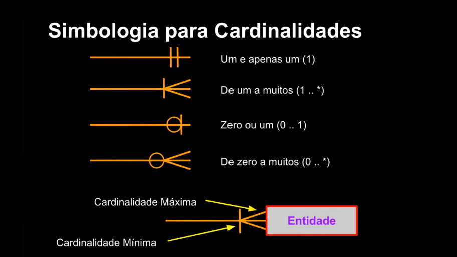
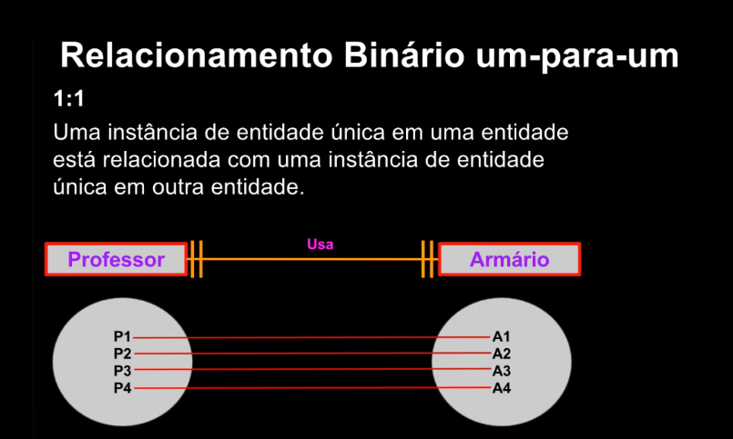

::Anotações que fiz para estudo e consultas futuras. Este material está relacionado com os vídeos do "Curso de Modelagem de Dados" da "Bóson Treinamentos". É possível [acessar por este endereço no youtube](https://www.youtube.com/playlist?list=PLucm8g_ezqNoNHU8tjVeHmRGBFnjDIlxD) a playlist completa do curso.

## O que é Banco de Dados

[Modelagem de Dados - Conceitos de Bancos de Dados - YouTube](https://youtu.be/Q_KTYFgvu1s)

São uma organização de dados para serem processados, normalmente salvos em um arquivo de banco de dados, que é lido e manipulado por um SGDB (Data Base Management System).

# Diferença de Dados e Informação

Os **dados** são fatos que podem ser armazenados em algum lugar para acesso posterior, não há nenhuma utilização prática aqui, são dados puros e sem um contexto definido.

- Nome de algum cliente

- CPF

- Data de nascimento

Já **Informação** são os dados processados e organizados para um determinado fim, normalmente se utilizando dos dados armazenados.

- Uma lista dos primeiros 10 clientes registrados por ordem.

- Clientes que fazem aniversário no mês atual.

# Metadados

Dados sobre outros dados, que são dados para facilitar a identificação de dados no banco de dados. Mantidos nos chamados "Dicionário de Dados" ou "Catálogo de Dados".

# Modelos

[Modelagem de Dados - O Modelo Relacional - Introdução - YouTube](https://www.youtube.com/watch?v=hGstS10kCPM&list=PLucm8g_ezqNoNHU8tjVeHmRGBFnjDIlxD&index=2)

Um Modelo é uma representação que ajuda a organizar os conceitos que serão aplicados no banco de dados real. O conceito de Modelagem de Dados é o processo de criação destes modelos.

### Tipos de Modelos

- Hierárquico

- Rede

- Relacional

- Orientado a Objeto

- Não-Relacional

## Modelo Entidade-Relacionamento

O Modelo Entidade-Relacionamento (MER) cria uma ilustração das entidades e os relacionamentos entre elas.

- **Entidades**: São uma representação de um conjunto de informações sobre determinado conceito. Por exemplo: Clientes, Funcionários, Pedidos e Produtos.

- **Atributo**: Algo que descreve ou qualifica uma entidade. Podem ser obrigatórios ou opcionais. Exemplo: Entidade Cliente possui atributos que descrevem seu nome, endereço, telefone, número de identificação, entre outros.

- **Relacionamento**: Trata-se de uma associação nomeada entre entidades, com um grau de associação. Por exemplo, clientes podem estar associados a pedidos.

## Convenções

- **Entidades**: Nome único, singular; em caixa alta;

- **Atributos**: Nome no singular; caixa baixa; Atributos obrigatórios marcados com '*'; identificador único marcado com '#'.

- **Relacionamento**: nome identificador (verbo); opcionalidade ("deve ser" ou "pode ser"); grau ou cardinalidade ('um e apenas um ', ou 'um ou mais').

**Cardinalidade**: significa que cada entidade pode ser ou deve em relação de forma uma e apenas uma ou uma ou mais com outra entidade.

## Identificador único (UID)

Um identificador único é qualquer combinação de atributos ou relacionamentos que são usados para distinguir ocorrências de uma entidade. Cada ocorrência de entidade de ser identificável de forma exclusiva.

# Modelagem de Dados

## Níveis

- Modelo Conceitual (Alto nível) - MCD

- Modelo Lógico - MLD

- Modelo Físico (baixo nível) - MFD

## MCD/MLD

Modelo Conceitual de Dados / Modelo Lógico de Dados

Primeira fase de modelagem, onde representamos o mundo real por meio de uma visão simplificada dos dados e seus relacionamentos. Assim podemos determinar quais informações serão armazenadas no BD. Neste nível o projeto é independente de SGBD.

**Exemplo**: 

**Cadastro de produtos em uma loja:**

Dados necessários: Nome do produto, categoria de produto (limpeza, alimentos, etc), código do fornecedor, tipo de embalagem, tamanho, quantidade.

Os detalhes da implementação não aparecem, porém é o suficientemente detalhado para o ponto de ser possível descrever os tipos de dados requeridos, seus relacionamentos entre si e regras de consistência.

# MER

Modelo Entidade-Relacionamento.

É um tipo de modelo conceitual que permite representar de forma abstrata a estrutura do banco de dados. É composto por Entidades, Atributos e Relacionamentos.

O MER é uma maneira sistemática de descrever e definir um processo de negócio. 

O processo é modelado como componentes (entidades) que são ligadas umas às outras por relacionamentos que indicam as dependências entre elas. 

As entidades podem ter várias propriedades (atributos) que as caracterizam.

Diagramas são criados para representar graficamente entidades, atributos e relacionamentos, denominados Diagramas Entidade-Relacionamento (DER).

## Componentes do DER

- Retângulos - Representam entidades.
- Elipses - Representam atributos.
- Losangos - Representam relacionamentos.
- Linhas - Ligam atributos a entidades e entidades a relacionamentos.

# O que são entidades

## Entidade

- Algo de importância para um usuário ou organização que precisa ser representado em um banco de dados.
- Representa um tema, tópico ou conceito de negócio.
- Cada objeto de entidade é denominado de **Instância de Entidade**.
- Uma entidade pode ter existência física ou abstrata.

Exemplos: Empregados, Livros, Vendas, Produtos, Pacientes, Clientes, etc.

- Nomeamos as entidades usando substativos que representam de forma clara e objetiva sua função.
- Por exemplo, podemos ter em um sistema as entidades Produto, Cliente, Venda, Estoque, Catálogo, entre outras.

### Regras de nomeação de entidades

- Devem começar com uma letra;
- Usar palavra no singular;
- Não podem ter espaços ou alguns caracteres especiais;
- Alguns caracteres como "$", "\#", e "\__" são permitidos em alguns bancos de dados.
- Os nomes de colunas devem ser únicos dentro de uma tabela.
- Os nomes de entidades / tabelas devem ser únicos dentro do esquema (tudo que é representado no banco de dados).

### Instância de Entidade
Uma entidade em si é uma descrição de um estrutura e formato das ocorrências da entidade, como uma "receita", ou "planta". Uma instância de entidade é uma ocorrência específica de uma entidade.

# O que são atributos

- Os atributos descrevem características da entidade, como por exemplo: fabricante, modelo, cor, placa, etc
- Os atributos possuem um tipo de dados (domínio) nome e valor específico. 

## Representando atributos

- Os atributos podem ser representados por uma elipse contendo o seu nome, ligado à entidade que qualifica.
- Opcionalmente, podemos representar um atributo apenas pelo seu nome ligado à entidade, sem utilizar a elipse.

## Tipos de atributos

Os atributos podem ser de vários tipos, tais como:

- Simples;
- Composto;
- Multivalorado;
- Determinante;
- Identificador;

Entre outros.

### Atributo simples / Atômico

Não possui característica especiais, e são indivisíveis.

Ex.: Nome da empresa, CPF, CNPJ.

### Atributo Composto

É formado por itens menores; pode ser subdividido em outros atributos.

Ex.: Endereço da empresa

Empresa possui o atributo "Endereço" que pode ser dividido em "Rua", "CEP" e "Bairro".

### Atributo Multivalorado

Pode conter mais de um valor para um mesmo registro (informação).

Ex.: Telefone da empresa

Empresa pode ter um atributo "Telefone" com vários telefones registrados. É colocado um asteriscos para indicar que é um atributo multivalorado.

### Atributo Determinante

Define de forma única as instâncias de uma entidade.

Não podem existir duas instâncias com o mesmo valor nesse atributo.

Ex.: CNPJ da empresa, Código do Produto.

Empresa tem o atributo "CNPJ" que é único e não existe outra empresa com o mesmo valor. Normalmente é sublinhado no diagrama o nome do atributo determinante.

### Atributos Identificadores ("Chaves")

Uma **chave** identifica uma instância específica na classe de entidade. 

Ex.: CPF, CódigoProduto, Matrícula, ID_Setor

As chaves podem ser únicas ou não-únicas:
- Únicas: O valor dos dados da chave é único na entidade.
- Não-única: Usada para agrupar instâncias de classe em categorias.
As chaves podem ser compostas, consistindo de dois ou mais atributos combinados.

## Exemplos de Representação de Entidades e Atributos

Podemos também representar uma entidade de forma textual:

Produto (Cod_produto, Nome_Produto, Preço, Qtde_Estoque)

# Relações
[Relações](https://www.youtube.com/watch?v=CdbYZGEClLg&list=PLucm8g_ezqNoNHU8tjVeHmRGBFnjDIlxD&index=7)

## Entidade x Relação

- Uma Entidade é um conceito do mundo real, como por exemplo um Cliente ou um Produto.
- Uma Relação é um conjunto de registros (tuplas) que representam um modelo de uma entidade.
- Cada registro representa uma instância de entidade, e o conjunto de todas as instâncias, com seus atributos, é chamado de Relação.

Relação é uma tabela bidimensional com características específicas, composta por linhas e colunas, criada a partir de uma entidade.

**Características de uma relação:**

- Linhas contém dados sobre instâncias de uma entidade (registros)
- Colunas contém dados sobre atributos da entidade (campos)
- Cada célula da tabela armazena um único valor
- Todos os valores em uma coluna são do mesmo tipo (domínio)
- Cada coluna possui um nome único
- Não há duas linhas idênticas 
- As relações geralmente geram tabelas no banco.

## Exemplo de uma Relação

"Toda Relação é uma tabela, mas nem toda tabela é uma relação".

# Relacionamentos
[O que são relacionamentos](https://www.youtube.com/watch?v=KSw0rTGEwPI)

- As Entidades podem ser conectadas entre si por meio de Relacionamentos. Trata-se de uma estrutura que indica a associação de elementos de uma ou mais entidades.

## Por que precisamos de relacionamentos?

- Como os dados de diferentes entidades são armazenados em tabelas distintas, geralmente precisamos combinar duas ou mais tabelas para responder às perguntas específicas dos usuários.
- Por exemplo, podemos querer saber quais produtos, e em qual quantidade, foram adquiridos por um cliente em particular. Precisaremos então de dados das tabelas de clientes, de pedidos e produtos para obter essa informação.

## Representando relacionamentos

- Representamos um Relacionamento em um DER por meio de um Losango que conecta uma ou mais Entidades:

## Grau de um Relacionamento

O grau de um relacionamento define o número de entidades que participam do relacionamento. Assim, um relacionamento pode ser:

- Unário
- Binário
- Ternário

Os relacionamentos mais comuns são os de grau 2 (binário).

## Relacionamento unário

## Relacionamento Binário

Funcionário --- TRABALHA --- Setor

## Relacionamento Ternário

Médico --- PRESCREVE --- Paciente && Medicamento

## Relacionamentos entre Tabelas

Uma tabela é relacionada com outras tabelas. Por exemplo, um produto é vendido em uma loja.

O grau de um Relacionamento indica o número de entidades envolvidas no relacionamento, como por exemplo, unário, binário e ternário.

## Efetuando relacionamento entre múltiplas tabelas

- Cada linha de dados em uma tabela deve ser identificada de forma única usando-se uma Chave Primária (identificador exclusivo).
- Usamos uma Chave Estrangeira para relacionar os dados entre múltiplas tabelas.
- Usamos para isso o relacionamento entre chave primária de uma tabela com a chave estrangeira em outra tabela.

# Chave Primária, Estrangeira e outras
[Chave Primária, Estrangeira e outras](https://www.youtube.com/watch?v=sbIT5UXTEg8)

## Chaves
Uma chave consiste em uma ou mais colunas de uma relação cujos valores são usados para identificar de forma exclusiva uma linha ou conjunto de linha.

Pode ser única (identifica uma única linha) ou não-única (identifica um conjunto de linhas).

Únicas (Unique): Candidata, Composta, Primária, Surrugada
Não-Única (Non-Unique): Estrangeira

## Chave Candidata

- Atributo ou grupo de atributos com o potencial para se tornarem uma chave primária.
- Uma chave candidata que não seja usada como chave primária será conhecida como **Chave Alternativa**.

Ex.: Campos Num_Matrícula e CPF em uma tabela de registros de alunos.

## Chave Primária

- Chave candidata escolhida para ser a **chave principal** na relação.
- Identifica de forma **exclusiva** os registros em uma tabela, não podendo ter repetição de valores nem tampouco valor nulo.
- Primary Key / PK

## Chave Estrangeira

- Coluna de uma tabela que estabelece um **Relacionamento com a Chave Primária (PK)** de outra tabela.
- É a partir da chave estrangeira (Foreign Key / FK) que sabemos com qual registro em outra tabela um registro está relacionado.

## Chave Composta

- Chave que é composta de dois ou mais atributos (colunas)
- Geralmente empregada quando não é possível utilizar uma única coluna de uma tabela para identificar de forma exclusiva seus registros.

## Chave Surrogada / Substituta

- Valor numérico, único, adicionado a uma relação para servir como chave primária.
- Não possui significado para os usuários e geralmente fica escondida nas aplicações.
- As chaves substitutas são frequentemente usadas no lugar de uma chave primária composta.

## Instruções para criação de chave primárias e estrangeiras

- Não é possível haver valores duplicados em uma chave primária
- No geral, não é possível alterar o valor de uma chave primária
- Chaves estrangeiras são baseadas em valores de dados, classificadas como ponteiros lógicos.
- Um valor de uma chave estrangeira deve corresponder a um valor existente em uma chave primária associada (ou valor de chave única). Caso contrário, deve ser nulo (NULL).
- Uma chave estrangeira deve referencias uma chave primária ou uma coluna de chave única.

## O conceito de Domínio

- Definir tipos de dados
- Especificar valores válidos em um campo

<table>
	<tr>
		<th>tbl_Clientes</th>
	</tr>
	<tr>
		<th>Campo</th>
		<th>Tipo de Dado</th>
		<th>Tamanho</th>
	</tr>
	<tr>
		<td>ID_Cliente</td>
		<td>Número</td>
		<td>4 caracteres</td>
	</tr>
	<tr>
		<td>Nome_Cliente</td>
		<td>Caractere</td>
		<td>40 caracteres</td>
	</tr>
	<tr>
		<td>CPF_Cliente</td>
		<td>Caractere</td>
		<td>11 caracteres</td>
	</tr>
	<tr>
		<td>Data_Nasc</td>
		<td>Data e Hora</td>
		<td>8 caracteres</td>
	</tr>
</table>

# Cardinalidade
[O que são Cardinalidades](https://www.youtube.com/watch?v=OVBFFe4-jSM&list=PLucm8g_ezqNoNHU8tjVeHmRGBFnjDIlxD&index=10)

A cardinalidade diz respeito ao número de itens que se relacionam nas entidades.

A cardinalidade pode ser máxima ou mínima, significando respectivamente os números mínimo e máximo de instâncias de cada entidade associadas no relacionamento.

**Cardinalidade Máxima**: Trata-se do número máximo de instâncias de entidade que podem participar em relacionamento. Pode ser 1 ou N (muitos).

**Cardinalidade Mínima**: Número mínimo de instâncias de entidade que **_devem obrigatoriamente participar em relacionamento_**; zero é a participação opcional e um é obrigatória.

## Simbologia para Cardinalidades

Usando a notação de Peter Chen:

Notação "pé de galinha" (Crow's Foot):

## Exemplo de Cardinalidade

Quantas encomendas um cliente pode ter? 
(1, N) O cliente pode ter no mínimo um e máximo várias encomendas.

Quantos clientes uma encomenda pode ter?
(1, 1) A encomenda pode ter no mínimo um cliente e no máximo também um cliente, pois só pode ser solicitada por um.

## Relacionamento binário um-para-um 1:1

Uma instância de entidade única em uma entidade está relacionada com uma instância de entidade única em outra entidade.

O professor normalmente só acessa um armário por vez. E um armário só é acessado por um professor por vez. (depende da regra de negócio do banco que está sendo modelado)

Utilizando a notação de Peter Chen:

## Relacionamento Binário um-para-muitos 1:N

Uma instância de entidade única em uma classe de entidade está relacionada a muitas instâncias de entidade em outra classe de entidade.

Um funcionário TRABALHA em no mínimo um e no máximo um departamento.
Em um departamento, quantos funcionários trabalham? Em um departamento, o mínimo um (não faz sentido estar vazio) e no máximo vários funcionários.

## Relacionamento Binário muitos-para-muitos N:M

Muitas instâncias em uma entidade estão relacionadas a muitas instâncias de entidade em outra entidade.

Pacotes de viagens

Um cliente pode adquirir quantos pacotes?
No mínimo um e no máximo muitos.

Um pacote pode ser adquirido por quantos clientes?
Pode ser adquirido por no mínimo 1 e máximo por vários clientes.

Usando notação de Peter Chen:

## Desmembrando Relacionamento Muitos-para-muitos

Cliente e Pacote
O cliente pode comprar um monte de pacotes e os pacotes podem ser adquiridos por muitos clientes.

# Restrições de Integridade
[Restrições de Integridade](https://www.youtube.com/watch?v=BurdDn16ZgE&list=PLucm8g_ezqNoNHU8tjVeHmRGBFnjDIlxD&index=11)

## Integridade de dados

Manutenção e garantia da consistência e precisão dos dados, sendo um aspecto crítico no design, implementação e uso de sistemas de armazenamento de dados.

A integridade é atingida por meio da aplicação de *Restrições de Integridade*.

## Restrições de Integridade

- Integridade Referencial
- Integridade de Domínio
- Integridade de Vazio
- Integridade de Chave
- Integridade Definida pelo Usuário

## Integridade de Domínio

Valores inseridos em uma coluna devem sempre obedecer à definição dos valores que são permitidos para essa coluna - os valores do **domínio**.

Exemplo: em uma coluna que armazena preços de mercadorias, os valores admitidos são do domínio numérico - ou seja, apenas números.

## Integridade de Domínio - Fatores

- Tipo de Dado do campo
- Representação interna do tipo de dado
- Presença ou não de dado
- Intervalos de valores no domínio
- Conjuntos de valores discretos

## Integridade de Domínio - Exemplo

Atributo ***Preço do produto***: Valor Monetário

- Valor permitido: 25,33
- Valores não permitidos: 25 reais e 33 centavos, -32,33

## Integridade Referencial

Uma restrição de Integridade Referencial assegura que valores de uma coluna em uma tabela são válidos baseados nos valores em uma outra tabela relacionada.

Exemplo: Se um produto de ID 523 foi cadastrado em uma tabela de Vendas, então um produto com ID 523 deve existir na tabela de Produtos relacionada.

## Integridade Referencial - Exemplo

Atributo ***Nome_Produto***: Caracteres

- Valores permitidos (produtos cadastrados): Água, Refrigerante, Suco.
- Valores não permitidos para venda (não existentes na tabela de produtos): Cerveja.

## Integridade Referencial - Atualização e Exclusão

Se um registro for excluído em uma tabela, então os registros relacionados em outras tabelas que o referenciam talvez precise ser excluídos.

Caso contrário ocorrerá erro.
O mesmo se dá com a atualização de registros.

## Integridade de Vazio

Este tipo de integridade informa se a coluna é obrigatória ou opcional - ou seja, se é possível não inserir um valor na coluna. Uma coluna de chave primária, por exemplo, sempre deve ter dados inseridos, e nunca pode estar vazia, para nenhum registro.

## Valores Nulos (NULL)

Um valor NULL significa que não existem dados. É diferente de zero, espaço, string vazia ou tabulação.

Os nulos podem ser problemáticos, pois indicam:

- O valor da coluna não é apropriado;
- O valor não foi inserido;
- O valor é desconhecido.

## Exemplos de Valores NULL

Suponha uma tabela de cadastro de alunos. Todo aluno deverá ter um nome cadastrado, de modo que esse campo é obrigatório (atributo não-nulo). Nem todo aluno possui telefone, portando esse campo não é obrigatório (atributo nulo).

# Integridade de Chave

Os valores inseridos na coluna de chave primária (PK) devem sempre ser únicos, não admitindo-se repetições nesses valores. Desta forma, as tuplas (registros) serão sempre distintas. Os valores de chave primária também não podem ser nulos.

## Integridade Definida pelo Usuário

Diz respeito a regras de negócio específicas que são definidas pelo usuário do banco de dados. Por exemplo, pode-se definir que uma coluna somente aceitará um conjunto restrito de valores.

# Diagramação - Notações Gráficas

[Diagramação - Notações Gráficas (Bóson Treinamentos)](https://www.youtube.com/watch?v=9plIQlzzPHA&list=PLucm8g_ezqNoNHU8tjVeHmRGBFnjDIlxD&index=12)

- O Diagrama Entidade e Relacionamento é a representação gráfica de um MER, que é um modelo conceitual.
- O uso de um diagrama facilita a modelagem e a comunicação entre os membros da equipe de desenvolvimento, permitindo que todos falem a mesma "língua" durante o processo.
- A notação original do DER foi proposta por Peter Chen.

Existem vários métodos para representar relacionamentos entre entidades.

As notações gráficas mais utilizadas em modelagem de dados são:

- IDEF1X
- Bachman
- Min-Max
- Pé de Galinha (Crow's Foot)
- Matin
- UML
- Peter Chen

## Softwares para Diagramação

Ferramentas CASE

- Astah
- Lucidchart
- erwin Data Modeler
- ERDPlus
- GenMyModel
- Star UML
- Microsoft Visio
- MySQL Workbench
- Visual Paradigm

# Dicionário de Dados

[Dicionário de dados (Bóson Treinamentos)](https://www.youtube.com/watch?v=-DESqE_GdEA&list=PLucm8g_ezqNoNHU8tjVeHmRGBFnjDIlxD&index=13)

